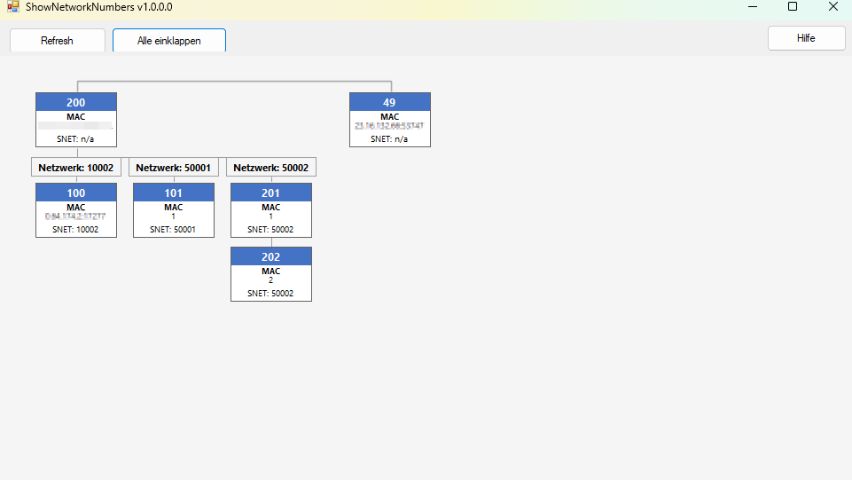

# ShowNetworkNumbers Plugin für Yabe

Ein Yabe-Plugin zur visuellen Darstellung der BACnet-Netzwerktopologie. Es zeigt alle entdeckten Geräte gruppiert nach Router und Subnetzwerk (SNET) in einem interaktiven Diagramm.

## Screenshot



## Funktionalität

Das Plugin liest die von Yabe entdeckten BACnet-Geräte aus und stellt sie als Baumstruktur dar:

- **Router-Ebene** – Jeder Router (eindeutige IP-Adresse) erscheint als eigene Karte oben
- **SNET-Ebene** – Darunter werden die Geräte nach Source Network Number (SNET) in Spalten gruppiert
- **Gerätekarten** – Jedes Gerät zeigt Device-ID, MAC-Adresse und SNET-Nummer
- **Verbindungslinien** – Grafische Linien visualisieren die Baumstruktur (Router → SNET → Gerät)

### Hauptfeatures

✅ **Automatische SNET-Erkennung**
- Liest den korrekten SNET-Wert aus `BacAdr.RoutedSource.net` (für geroutete Geräte)
- Fallback auf `BacAdr.net` für direkt erreichbare Geräte

✅ **Interaktive Topologie-Ansicht**
- Spalten per Klick ein-/ausklappen (`[+]` / `[-]`)
- Globaler Button „Alle ausklappen / Alle einklappen"
- Scrollbalken (horizontal und vertikal) für große Netzwerke
- Standardmäßig alle Spalten eingeklappt

✅ **Kompakte Gerätekarten**
- Blauer Header mit Device-ID
- MAC-Adresse (für geroutete Geräte: RoutedSource-Adresse)
- SNET-Nummer im Footer

✅ **Refresh**
- Button zum erneuten Einlesen aller von Yabe entdeckten Geräte

## Installation

### Voraussetzungen
- Yabe muss installiert sein (oder aus dem Quellcode kompiliert)
- .NET Framework 4.8+

### Installationsschritte

1. **Plugin-Datei herunterladen oder kompilieren**
   - Release von GitHub herunterladen: `ShowNetworkNumbers.dll`
   - ODER selbst kompilieren.

2. **Plugin ins Yabe-Verzeichnis kopieren**
   - Finde dein Yabe-Installationsverzeichnis
   - Erstelle einen `Plugins`-Ordner falls noch nicht vorhanden:
     ```
     C:\Program Files\Yabe\Plugins\
     ```
   - Kopiere `ShowNetworkNumbers.dll` in diesen `Plugins`-Ordner

3. **Config-Datei anpassen**
   - Prüfe ob `Yabe.exe.config` im Yabe-Verzeichnis existiert
   - **Falls nicht:** Erstelle oder kopiere diese aus dem Yabe Repository.
     Wenn kopiert, Berechtigungen überprüfen: Rechtsklick auf `.config` → Eigenschaften → Tab Allgemein → Sicherheit → Zulassen
   - Erweitere die Plugin-Liste:
     ```xml
     <setting name="Plugins" serializeAs="String">
       <value>..., ..., ShowNetworkNumbers</value>
     </setting>
     ```

4. **Yabe neu starten**
   - Yabe komplett beenden
   - Yabe neu starten
   - Das Plugin erscheint im Menü: `Plugins` → `Show Network Numbers`
   - Falls das Menü nicht erscheint → Berechtigungen überprüfen: Rechtsklick auf `.dll` → Eigenschaften → Tab Allgemein → Sicherheit → Zulassen

## Bedienung

1. Yabe starten und BACnet-Netzwerk scannen lassen (Geräte entdecken)
2. Plugin über `Plugins` → `Show Network Numbers` öffnen
3. Auf **Refresh** klicken, um die aktuelle Geräteliste zu laden
4. Mit `[+]`-Buttons einzelne SNET-Spalten aufklappen
5. **Alle ausklappen** zeigt alle Geräte auf einmal

## Lizenz & Kontakt

Siehe LICENSE im Repository. Für Fragen zum Code bitte Issues/PRs im Repo verwenden.

https://buymeacoffee.com/pedrotepe
